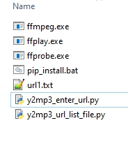

# YouTube-To-MP3
This Python script allows you to download audio from YouTube videos and convert them to MP3 format in 320 kbps.

**Features:**

* Validates YouTube video URLs.
* Extracts video title and removes non-alphabetical characters.
* Checks for video availability.
* Downloads the audio stream in MP4 format.
* Converts the MP4 audio to MP3 format.
* Cleans up by removing the downloaded MP4 file.

**Usage:**
1. Ensure you have the following libraries installed: `requests`, `pytube`, `os`, `pydub`, `re`, `urllib.parse`. You can install them using `pip install requests pytube os pydub re urllib.parse`. Run file pip_install.bat
2. Make sure you have FFmpeg installed on your system (https://github.com/BtbN/FFmpeg-Builds/releases) and the ffmpeg.exe, ffplay.exe, ffprobe.exe files in your project folder.
   
4. Run the code as `python y2mp3_enter_url.py` for 1 url youtube. Example Paste the YouTube video URL when prompted, "https://www.youtube.com/watch?v=6n9lTuZsD1c"
5. Run the script: `python y2mp3_url_list_file.py` download and convert multi urls in text file. Example text file 'url1.txt'
7. The script will download the audio, convert it to MP3, and save it in the same directory as the script.

**Note:**
* This script is for educational purposes only and should not be used for downloading copyrighted material without permission.
* This is a work in progress and may have bugs or limitations.

**Updates:**
* Direct MP4 to MP3 conversion has been achieved.
* Both www.youtube.com or youtu.be are accepted.

